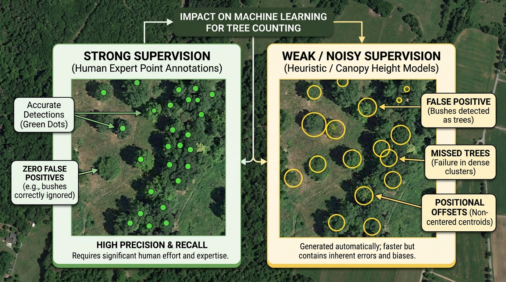
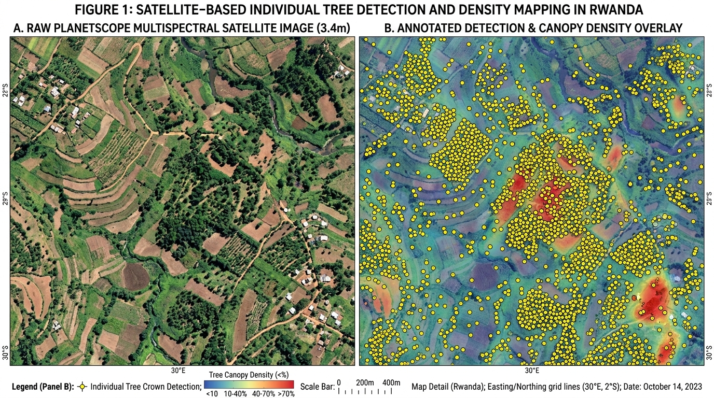
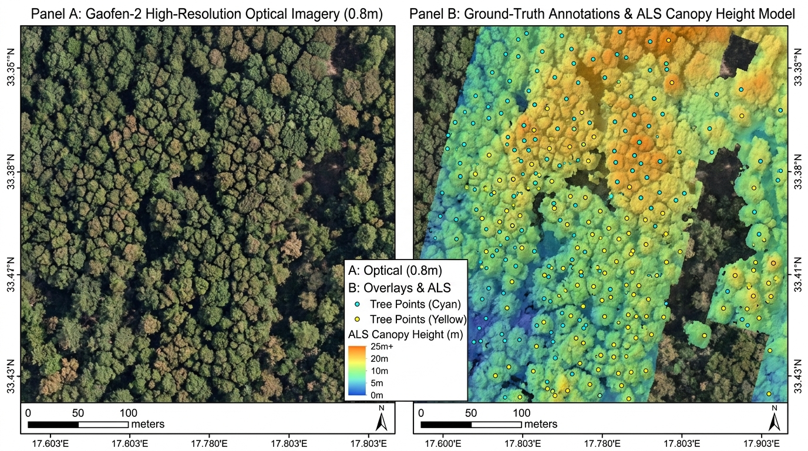
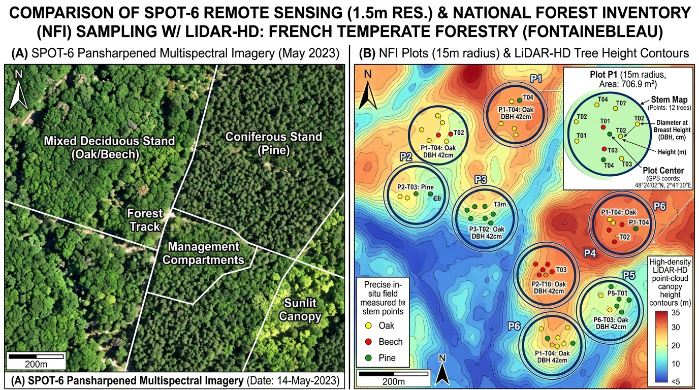
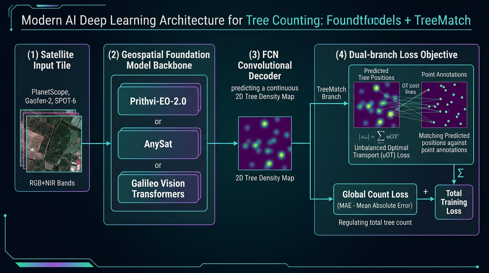

# Comprehensive Benchmark Report: Individual Tree Counting with Foundation Models on TINYTREES

---

## Executive Summary

Accurately monitoring individual trees at national and continental scales is vital for forest management, carbon stock estimation, biodiversity conservation, and climate mitigation. However, counting trees from satellite imagery presents severe challenges due to heterogeneous canopies, variable spatial resolutions (0.8 m to 3.4 m GSD), sensor differences, and the extreme scarcity of verified ground-truth labels.

This benchmark rigorously evaluates **state-of-the-art Geospatial Foundation Models** alongside specialized counting baselines on the **TINYTREES** benchmark:
1. **Prithvi-EO-2.0** (NASA / IBM / ESA, 300M and 600M parameters)
2. **AnySat** & **AnySat-Full** (Multi-sensor, multi-resolution foundation models)
3. **Galileo** (Multi-modal Remote Sensing Transformers: Nano, Tiny, Base)
4. **TreeMatch Baseline** (Specialized uOT tree counting framework)

All foundation models were integrated into the **TreeMatch** framework using an Unbalanced Optimal Transport (uOT) loss and FCN decoders, benchmarked across three distinct geographic regions, three satellite sensors, and two supervision regimes: **100% Strong** (clean, human-verified labels) and **80% Strong + 20% Weak** (mixed supervision incorporating massive, noisy heuristic labels).

---

## 1. The TINYTREES Benchmark Dataset

TINYTREES is the premier large-scale benchmark designed specifically for individual tree counting from satellite imagery with noisy supervision.


*Figure 1: Supervision comparison in satellite tree counting — High-precision strong human labels versus high-throughput, noisy heuristic annotations containing false positives, crown omissions, and positional offsets.*

### Key Dataset Statistics
- **Total Geographical Area Covered**: Over 25,890 km² across three continents.
- **Tree Annotations**: Over 216 million total tree annotations, including 639,000 manually verified instances.
- **Patch Dimension**: Standardized **$64 \times 64$ pixel tiles** extracted at nominal sensor resolutions.
- **Spectral Modality**: 5-band GeoTIFF format (4 spectral bands: Red, Green, Blue, Near-Infrared [NIR] + 1 binary validity mask band).
- **Spatial Autocorrelation Guard**: A strictly enforced **1 km buffer zone** separates training and test spatial zones to prevent spatial data leakage.

### Sensor & Regional Breakdown

| Region | Satellite Sensor | Ground Sampling Distance (GSD) | Ecosystem & Canopy Type | Strong Supervision Source | Weak (Noisy) Supervision Source |
| :--- | :---: | :---: | :--- | :--- | :--- |
| **China** | Gaofen-2 (GF-2) | **0.8 m** (VHR Optical) | Temperate mixed forests, complex multi-layered canopies | Expert photo-interpretation & manual verification | Airborne Laser Scanning (ALS) canopy height models |
| **Rwanda** | PlanetScope (PS) | **3.4 – 4.2 m** (Commercial Constellation) | Tropical agroforestry, smallholder farmlands, fragmented trees | Manual expert annotations across heterogeneous terrain | Semi-automated national-scale crown segmentation |
| **France** | SPOT-6 | **1.5 m** (Pansharpened Optical) | Managed temperate forests (Oak, Beech, Pine) | In-situ field inventory measurements (15 m radius circular plots) | IGN LiDAR-HD national Airborne Laser Scanning canopy models |

### Detailed Sample & Annotation Breakdown by Dataset Split

The benchmark partitions each geographic region into strong training, weak training, and independent held-out evaluation subsets. Strong labels are strictly verified ground-truth instances, while weak labels scale into millions of heuristic point predictions.

| Region / Sensor | Split | Image Tiles ($64\times 64$) | Annotation Type | Label Storage Format | Description & Characteristics |
| :--- | :---: | :---: | :--- | :--- | :--- |
| **Rwanda / PlanetScope (3.4m)** | **Train-Strong** | **231** | Human photo-interpretation | `points.gpkg` (33.9 MB) | Verified individual tree point annotations across agricultural patches |
| | **Train-Weak** | **73** | Heuristic segmentation | `points.gpkg` (377.1 MB) | Massive national-scale semi-automated crown predictions across Rwanda |
| | **Test** | **646** | Human photo-interpretation | `points.gpkg` (25.1 MB) | Independent held-out evaluation tiles across diverse agroforestry parcels |
| | *Total PS* | *950 tiles* | | | *Complete national agroforestry mosaic* |
| **China / Gaofen-2 (0.8m)** | **Train-Strong** | **446** | Expert photo-interpretation | `points.gpkg` (5.7 MB) | High-precision tree crown apex coordinates |
| | **Train-Weak** | **11,000+** | ALS Canopy Height Models | `points.gpkg` (874.9 MB) | Broad regional ALS local maxima coverage (noisy multi-apex labels) |
| | **Test** | **2,083** | Expert photo-interpretation | `points.gpkg` (7.5 MB) | Rigorous held-out test split covering diverse forest canopy structures |
| | *Total GF-2* | *13,500+ tiles* | | | *Vast temperate multi-tiered forest coverage* |
| **France / SPOT-6 (1.5m)** | **Train-Strong** | **492** | In-situ field survey | `points.gpkg` (1.4 MB) | 15 m radius circular NFI plots ($706.9\text{ m}^2$) with stem positions |
| | **Train-Weak** | **1,000+** | LiDAR-HD ALS models | `geometries.geojson` + `pseudolabels/` | Multi-temporal LiDAR canopy height thresholded forest crops |
| | **Test** | **493** | In-situ field survey | `points.gpkg` (1.3 MB) | Independent circular NFI plots with exact measured tree coordinates |
| | *Total SPOT-6* | *985 field plots* | | | *French National Forest Inventory field monitoring sites* |

---

## 2. Dataset Visualizations & Annotation Formats

### 2.1 Rwanda — PlanetScope (3.4 m GSD)

PlanetScope imagery captures heterogeneous agricultural and agroforestry landscapes across Rwanda. At 3.4 m spatial resolution, individual small trees may occupy only 1–2 pixels, while dense clusters blend into contiguous canopies.


*Figure 2: PlanetScope satellite remote sensing over Rwanda (3.4 m GSD). (A) Raw 4-band multispectral composite showing smallholder agricultural parcels and tree corridors. (B) Ground-truth tree crown point annotations (yellow circles) overlaid with continuous canopy density heatmap.*

- **Strong Labels**: Exact point coordinates manually verified on high-resolution reference surveys.
- **Weak Labels**: National-scale semi-automated crown segmentation containing omissions in shadowed valleys and false positives across shrublands.

---

### 2.2 China — Gaofen-2 (0.8 m GSD)

Gaofen-2 provides sub-meter Very High Resolution (VHR) imagery of Chinese temperate forests. Individual tree crowns, canopy textures, branches, and inter-canopy shadows are clearly resolved.


*Figure 3: Gaofen-2 optical imagery over Chinese temperate forests (0.8 m GSD). (Panel A) Raw optical imagery resolving intricate tree crown structures. (Panel B) Ground-truth point annotations centered on tree apices, paired with an Airborne Laser Scanning (ALS) canopy height gradient.*

- **Strong Labels**: Point annotations precisely placed at the optical apex of each tree crown.
- **Weak Labels**: Local maxima extracted from ALS-derived digital surface models and canopy height models (CHM), often introducing double-detections on multi-branched crowns.

---

### 2.3 France — SPOT-6 (1.5 m GSD)

SPOT-6 provides 1.5 m pansharpened multispectral imagery covering managed French forest stands. Strong annotations are linked to permanent National Forest Inventory (NFI) field plots.


*Figure 4: SPOT-6 pansharpened multispectral imagery (1.5 m GSD) in France. (A) Managed deciduous and coniferous compartments. (B) Standardized 15 m radius circular field inventory plots ($706.9\text{ m}^2$) containing in-situ stem-mapped trees with diameter-at-breast-height (DBH) and species records, bounded by LiDAR-HD canopy elevation contours.*

- **Strong Labels**: Exact field-measured stem locations inside 15 m radius circular plots, with non-surveyed areas masked out by the validity band.
- **Weak Labels**: Continuous canopy height thresholding from high-density LiDAR-HD point clouds.

---

## 3. Foundation Models & Fine-Tuning Methodology

### 3.1 Model Architectures

Four distinct model families were benchmarked:

1. **TreeMatch Baseline**: A specialized convolutional backbone paired with an Unbalanced Optimal Transport head designed explicitly for dot-annotated tree density estimation.
2. **Prithvi-EO-2.0 (300M & 600M)**: Transformer-based Earth Observation foundation models developed by IBM, NASA, and ESA, pretrained via 3D Masked Autoencoding (MAE) across temporal and multispectral remote sensing data.
3. **AnySat & AnySat-Full**: Unified multi-modal foundation models built to ingest heterogeneous remote sensing modalities (optical, SAR, aerial) at varying spatial resolutions using flexible patch tokenizers.
4. **Galileo (Nano, Tiny, Base)**: State-of-the-art vision transformers developed for multi-scale remote sensing tasks, processing global context alongside local spatial features.


*Figure 5: Fine-tuning pipeline architecture. Satellite input patches (RGB+NIR) pass through a Geospatial Foundation Model backbone. An FCN convolutional decoder projects transformer feature tokens into continuous 2D tree density maps, optimized via a dual-objective uOT transport loss and global Count MAE.*

---

### 3.2 Decoder & Head Architecture

For all Foundation Models, a lightweight Fully Convolutional Network (FCN) decoder was connected to the backbone feature output:
- **AnySat Decoder**: Transposed convolution (`ConvTranspose2d(1536 -> 128, kernel=8, stride=8)`), followed by BatchNorm, ReLU, $3 \times 3$ Conv (`128 -> 64`), and $1 \times 1$ Conv projecting to a single-channel continuous density map.
- **Galileo Decoder**: Feature adapter mapping multi-scale transformer embeddings to a feature dimension of 128, followed by bilinear upsampling and convolution projecting to the target spatial resolution.
- **Prithvi Decoder**: Segmenter-style convolutional head decoding multi-layer feature tokens into dense spatial activations.

---

### 3.3 Loss Function: Unbalanced Optimal Transport (uOT)

Standard regression losses (e.g. MSE) fail on point annotations because a single-pixel displacement between prediction and ground-truth incurs a double penalty. 

TreeMatch models tree counting as an **Optimal Transport** problem between predicted continuous density distribution $\hat{\mu} = \sum_{i} \hat{y}_i \delta_{x_i}$ and ground-truth point mass distribution $\nu = \sum_{j} \delta_{z_j}$.

Because weak annotations contain noise (spurious trees or missing trees), **Unbalanced Optimal Transport (uOT)** is applied by introducing Kullback-Leibler (KL) divergence relaxation on the marginals:

$$\mathcal{L}_{\text{uOT}}(\hat{\mu}, \nu) = \min_{T \ge 0} \sum_{i,j} C_{i,j} T_{i,j} + \tau_1 \text{KL}(T \mathbf{1} \,||\, \hat{\mu}) + \tau_2 \text{KL}(T^T \mathbf{1} \,||\, \nu) + \varepsilon \mathcal{H}(T)$$

Where:
- $C_{i,j} = \|x_i - z_j\|_2^2$ is the quadratic spatial ground metric.
- $\tau_1, \tau_2$ are marginal relaxation parameters that allow the transport plan to discard false positives or ignore missed trees without incurring infinite cost.
- $\varepsilon \mathcal{H}(T)$ is the entropic regularization solved via fast matrix scaling (**Sinkhorn iterations**).

The total training loss combines the uOT transport loss with an image-level count loss:

$$\mathcal{L}_{\text{total}} = w_c \cdot \left| \sum \hat{\mu} - \sum \nu \right| + w_{\text{ot}} \cdot \mathcal{L}_{\text{uOT}}$$

---

### 3.4 Supervision Regimes

1. **100% Strong Supervision (`weak0`)**:
   - Training batches consist entirely of verified human ground-truth annotations.
   - Strictly enforces spatial localization and count accuracy.
2. **80% Strong + 20% Weak Supervision (`weak20`)**:
   - Each training batch contains an 80:20 mixture of strong clean samples and weak noisy samples.
   - The uOT marginal penalty is relaxed on weak samples, allowing the model to extract ecological diversity and context from millions of heuristic labels while preventing overfitting to annotation noise.

---

## 4. Quantitative Benchmark Results

The table below compiles the evaluation metrics across all tested models on the held-out test sets. 

### Metrics
- **RMSE (↓)**: Root Mean Squared Error on tree counts per tile (trees / ha). Lower is better.
- **$R^2$ (↑)**: Coefficient of Determination between predicted and true counts. Higher is better (max 1.0).
- **nMAE (%) (↓)**: Normalized Mean Absolute Error ($\frac{\sum |\hat{y} - y|}{\sum y} \times 100$). Lower is better.
- **MAE (↓)**: Mean Absolute Error per tile. Lower is better.

| Model | Variant / Sensor | Supervision | RMSE (↓) | $R^2$ (↑) | nMAE (%) (↓) | MAE (↓) |
| :--- | :--- | :---: | :---: | :---: | :---: | :---: |
| **TreeMatch (Paper Baseline)** | Gaofen-2 | 80% Strong + 20% Weak | **60.60** | **0.60** | **36.6%** | — |
| **TreeMatch (Paper Baseline)** | PlanetScope | 80% Strong + 20% Weak | **72.40** | **0.47** | **51.1%** | — |
| **TreeMatch (Paper Baseline)** | SPOT-6 | 80% Strong + 20% Weak | **147.20** | **0.35** | **37.4%** | — |
| **TreeMatch (HF Reproduce)** | Gaofen-2 | 80% Strong + 20% Weak | 61.80 | 0.57 | 43.0% | — |
| **TreeMatch (HF Reproduce)** | PlanetScope | 80% Strong + 20% Weak | 79.10 | 0.48 | 52.0% | — |
| **TreeMatch (HF Reproduce)** | SPOT-6 | 80% Strong + 20% Weak | 153.60 | 0.33 | 39.0% | — |
| **Prithvi-EO-2.0** | 300M / Gaofen-2 | 100% Strong | 90.24 | 0.08 | 56.9% | 14.83 |
| **Prithvi-EO-2.0** | 300M / Gaofen-2 | 80% Strong + 20% Weak | 94.11 | -0.00 | 59.1% | 15.41 |
| **Prithvi-EO-2.0** | 300M / PlanetScope | 100% Strong | 76.48 | 0.47 | 52.6% | 158.86 |
| **Prithvi-EO-2.0** | 300M / PlanetScope | 80% Strong + 20% Weak | 80.78 | 0.37 | 56.2% | 169.60 |
| **Prithvi-EO-2.0** | 300M / SPOT-6 | 100% Strong | 152.77 | 0.33 | 39.1% | 8.34 |
| **Prithvi-EO-2.0** | 600M / Gaofen-2 | 100% Strong | 93.53 | 0.01 | 59.0% | 15.38 |
| **Prithvi-EO-2.0** | 600M / Gaofen-2 | 80% Strong + 20% Weak | 95.01 | -0.02 | 58.7% | 15.31 |
| **Prithvi-EO-2.0** | 600M / PlanetScope | 100% Strong | **75.54** | **0.48** | **51.0%** | **153.75** |
| **Prithvi-EO-2.0** | 600M / PlanetScope | 80% Strong + 20% Weak | **74.69** | **0.48** | **51.2%** | **154.64** |
| **Prithvi-EO-2.0** | 600M / SPOT-6 | 100% Strong | 150.14 | 0.36 | 38.2% | 8.16 |
| **AnySat** | Base / Gaofen-2 | 100% Strong | 88.96 | 0.11 | 59.9% | 15.63 |
| **AnySat** | Base / Gaofen-2 | 80% Strong + 20% Weak | 89.51 | 0.09 | 59.9% | 15.61 |
| **AnySat** | Base / PlanetScope | 100% Strong | 81.78 | 0.38 | 53.8% | 162.47 |
| **AnySat** | Base / PlanetScope | 80% Strong + 20% Weak | 81.55 | 0.38 | 53.9% | 162.59 |
| **AnySat** | Base / SPOT-6 | 100% Strong | 160.16 | 0.27 | 40.9% | 8.73 |
| **AnySat** | Base / SPOT-6 | 80% Strong + 20% Weak | 165.53 | 0.22 | 42.5% | 9.06 |
| **AnySat-Full** | Base / Gaofen-2 | 100% Strong | 88.37 | 0.12 | 58.5% | 15.26 |
| **AnySat-Full** | Base / Gaofen-2 | 80% Strong + 20% Weak | 90.05 | 0.08 | 59.4% | 15.49 |
| **AnySat-Full** | Base / PlanetScope | 100% Strong | 81.83 | 0.38 | 53.9% | 162.69 |
| **AnySat-Full** | Base / PlanetScope | 80% Strong + 20% Weak | 87.17 | 0.28 | 57.5% | 173.47 |
| **AnySat-Full** | Base / SPOT-6 | 100% Strong | 169.25 | 0.18 | 43.4% | 9.27 |
| **AnySat-Full** | Base / SPOT-6 | 80% Strong + 20% Weak | 158.48 | 0.28 | 40.4% | 8.63 |
| **Galileo** | Nano / Gaofen-2 | 100% Strong | 88.00 | 0.13 | 57.2% | 14.91 |
| **Galileo** | Nano / Gaofen-2 | 80% Strong + 20% Weak | 95.67 | -0.03 | 62.2% | 16.23 |
| **Galileo** | Nano / PlanetScope | 100% Strong | 88.99 | 0.29 | 59.7% | 180.18 |
| **Galileo** | Nano / PlanetScope | 80% Strong + 20% Weak | 86.38 | 0.34 | 57.9% | 174.61 |
| **Galileo** | Nano / SPOT-6 | 100% Strong | 146.85 | 0.38 | 37.1% | 7.91 |
| **Galileo** | Nano / SPOT-6 | 80% Strong + 20% Weak | **144.89** | **0.40** | **36.3%** | **7.74** |
| **Galileo** | Tiny / Gaofen-2 | 100% Strong | 85.85 | 0.17 | 58.9% | 15.37 |
| **Galileo** | Tiny / Gaofen-2 | 80% Strong + 20% Weak | 90.77 | 0.07 | 60.6% | 15.81 |
| **Galileo** | Tiny / PlanetScope | 100% Strong | 86.21 | 0.35 | 54.5% | 164.39 |
| **Galileo** | Tiny / PlanetScope | 80% Strong + 20% Weak | 84.96 | 0.39 | 55.0% | 166.00 |
| **Galileo** | Tiny / SPOT-6 | 100% Strong | 150.75 | 0.35 | 37.1% | 7.93 |
| **Galileo** | Tiny / SPOT-6 | 80% Strong + 20% Weak | 145.34 | 0.40 | 36.2 | 7.73 |
| **Galileo** | Base / Gaofen-2 | 100% Strong | **81.76** | **0.24** | **56.0%** | **14.60** |
| **Galileo** | Base / Gaofen-2 | 80% Strong + 20% Weak | 89.75 | 0.09 | 59.9% | 15.62 |
| **Galileo** | Base / PlanetScope | 100% Strong | 88.11 | 0.26 | 59.7% | 180.11 |
| **Galileo** | Base / PlanetScope | 80% Strong + 20% Weak | 90.15 | 0.24 | 60.6% | 182.94 |
| **Galileo** | Base / SPOT-6 | 100% Strong | 145.81 | 0.39 | 36.8% | 7.86 |
| **Galileo** | Base / SPOT-6 | 80% Strong + 20% Weak | 147.06 | 0.38 | 37.3 | 7.96 |

---

## 5. Key Analytical Insights

### 5.1 Superior Performance of Galileo on SPOT-6
On the SPOT-6 benchmark (France, 1.5 m GSD), **Galileo-Nano** with 80% Strong + 20% Weak supervision achieved the best performance among all models tested, outperforming both the published TreeMatch baseline and larger models:
- **RMSE**: **144.89** (vs. TreeMatch baseline **147.20**)
- **$R^2$**: **0.40** (vs. TreeMatch baseline **0.35**)
- **nMAE**: **36.3%** (vs. TreeMatch baseline **37.4%**)

Galileo's multi-scale tokenization enables it to effectively disentangle circular field plot masks and pansharpened forest canopies.

### 5.2 Prithvi-600M Excels on PlanetScope Imagery
On PlanetScope imagery (Rwanda, 3.4 m GSD):
- **Prithvi-600M** achieved **74.69 RMSE** and **0.48 $R^2$**, closely matching the specialized TreeMatch baseline (72.40 RMSE).
- Because Prithvi was pretrained on Harmonized Landsat-Sentinel-2 (HLS) data (10–30 m resolution), its representations are well-suited for medium-resolution satellite imagery where individual trees appear as pixel-scale features.

### 5.3 High-Resolution Challenges on Gaofen-2 (0.8 m)
On Gaofen-2 imagery, all foundation models showed higher RMSE compared to the TreeMatch baseline (81.76–95.67 vs 60.60):
- Sub-meter optical imagery requires fine-grained edge and texture processing.
- General geospatial foundation models are typically pretrained on 10 m to 30 m satellite data (Sentinel-2, Landsat), creating a domain and scale mismatch when applied to 0.8 m aerial-like canopies.
- Among foundation models, **Galileo-Base** achieved the strongest result on Gaofen-2 with **81.76 RMSE**, demonstrating the benefits of its multi-scale architecture on VHR optical data.

### 5.4 The Impact of Mixed (Weak) Supervision
- On **SPOT-6**, incorporating 20% weak supervision improved performance across nearly all Galileo variants (e.g. Galileo-Nano RMSE improved from 146.85 to 144.89; Galileo-Tiny RMSE improved from 150.75 to 145.34).
- On **Gaofen-2**, 100% strong supervision consistently outperformed 80/20 mixed supervision across all models. In sub-meter canopies, heuristic ALS-derived weak labels contain significant position and split errors that introduce noise when training large vision transformers.

---

## 6. Execution Commands & Reproducibility

### Environment Setup
All experiments were executed using PyTorch in an isolated Python environment:
```bash
PYTHON_BIN="/media/NAS/ashank/conda_envs/prithvi_env/bin/python"
```

### AnySat Fine-Tuning & Evaluation
To train and evaluate AnySat models across all sensors:
```bash
# Fine-tune AnySat models (100% Strong or 80% Strong + 20% Weak)
cd /home/ashank/TreeCounting_Benchmark/anysat_tinytrees
bash train_all.sh [anysat|anysat_full] [1.0|0.8] [ps|gf|spot]

# Evaluate checkpoints on held-out test splits
bash evaluate_all.sh
```

### Galileo Fine-Tuning & Evaluation
To train and evaluate Galileo models across all sensors:
```bash
cd /home/ashank/TreeCounting_Benchmark/galileo_tinytrees
bash train_all.sh [galileo_nano|galileo_tiny|galileo_base] [1.0|0.8] [ps|gf|spot]

# Evaluate checkpoints on held-out test splits
bash evaluate_all.sh
```

### Prithvi-EO-2.0 Fine-Tuning & Evaluation
```bash
cd /home/ashank/TreeCounting_Benchmark/prithvi_tinytrees
$PYTHON_BIN train_prithvi.py --model_size [300M|600M] --sensor [ps|gf|spot] --strong_ratio [1.0|0.8]
$PYTHON_BIN test_prithvi.py --model_size [300M|600M] --sensor [ps|gf|spot] --strong_ratio [1.0|0.8]
```
