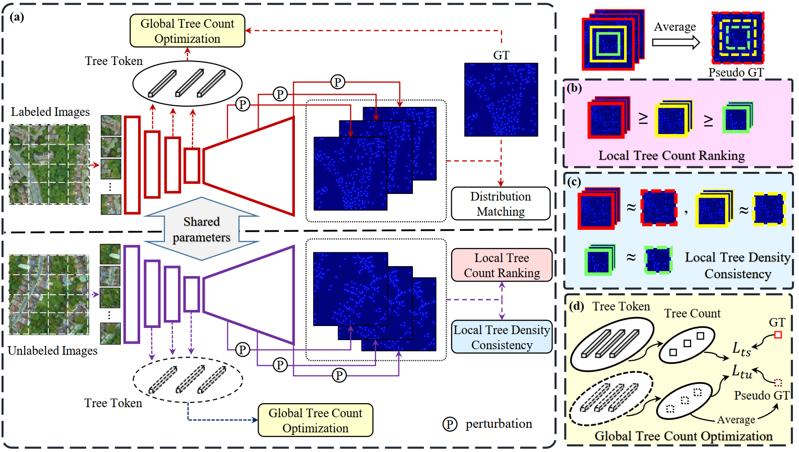

# TreeFormer

This is the code base for IEEE TRANSACTIONS ON GEOSCIENCE AND REMOTE SENSING (TGRS 2023) paper ['TreeFormer: a Semi-Supervised Transformer-based Framework for Tree Counting from a Single High Resolution Image'](https://arxiv.org/abs/2307.06118)



## Installation

Python ≥ 3.7.

To install the required packages, please run:


```bash
  pip install -r requirements.txt
```
    
## Dataset
Download the dataset from [google drive](https://drive.google.com/file/d/1xcjv8967VvvzcDM4aqAi7Corkb11T0i2/view?usp=drive_link).
## Evaluation
Download our trained model on [London](https://drive.google.com/file/d/14uuOF5758sxtM5EgeGcRtSln5lUXAHge/view?usp=sharing) dataset.

Modify the path to the dataset and model for evaluation in 'test.py'.

Run 'test.py'

## Fine-tune MCNN On KCL London (inside TreeFormer)

This repository now includes a dedicated MCNN fine-tuning pipeline that is independent from the TreeFormer training script.

New files:

- `network/mcnn.py`: MCNN architecture
- `datasets/mcnn_kcl.py`: KCL/London data loader for MCNN
- `train_mcnn_kcl.py`: fine-tuning script

### 1) Install dependencies

```bash
pip install -r requirements.txt
```

### 2) Run MCNN fine-tuning

From the `TreeFormer` directory:

```bash
python train_mcnn_kcl.py \
  --data-dir datasets \
  --train-split train_data \
  --val-split valid_data \
  --epochs 300 \
  --batch-size 8 \
  --crop-size 256 \
  --lr 1e-5 \
  --device 0
```

### 3) Optional: initialize from legacy MCNN weights

If you want to start from the legacy crowdcount-mcnn checkpoint:

```bash
python train_mcnn_kcl.py \
  --data-dir datasets \
  --pretrained ../crowdcount-mcnn/final_models/mcnn_shtechA_660.h5 \
  --device 0
```

Checkpoints are written to `ckpts/mcnn_kcl/<timestamp>/`:

- `latest.pth`: latest epoch
- `best_mae.pth`: best validation MAE so far

Training metadata and graphs are also saved in the same folder:

- `hparams.json`: full run hyperparameters
- `history.csv`: per-epoch metrics (`train_mse`, `val_mae`, `val_mse`)
- `metrics.json`: metrics history and best MAE summary
- `train_mse_curve.png`: training MSE curve
- `val_curves.png`: validation MAE/MSE curves (available after validation runs)

### 4) Evaluate a fine-tuned checkpoint

```bash
python test_mcnn_kcl.py \
  --data-dir datasets \
  --split test_data \
  --model-path ckpts/mcnn_kcl/<timestamp>/best_mae.pth \
  --device 0
```

This writes per-image `.mat` files and a `test.txt` summary into `predictions_mcnn/` by default.

## Latest Evaluation Run (2026-04-09)

Command used:

```bash
python test.py
```

Run summary:

- Number of validation/test images: 161
- Model checkpoint: `datasets/best_model.pth`
- MAE: 16.595294762842403
- MSE: 22.87350238875944
- R2: 0.7560897679667686

Console output (summary line):

```text
datasets/best_model.pth: mae 16.595294762842403, mse 22.87350238875944, R2 0.7560897679667686
```

Per-image prediction logs (image name, error, GT count, model output) are printed by `test.py` during evaluation and also written to `test.txt`.

## Acknowledgements

 - Part of codes are borrowed from [PVT](https://github.com/whai362/PVT) and [DM Count](https://github.com/cvlab-stonybrook/DM-Count). Thanks for their great work!
 

